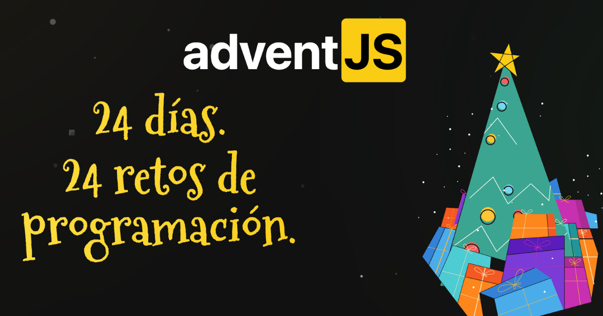

# AdventJS 2022

- [AdventJS](https://adventjs.dev/ "AdventJS")
- Soluciones con Javascript

# Retos

| Nº  | Título                                            | Dificultad | Solución                                                                |
| --- | ------------------------------------------------- | ---------- | ----------------------------------------------------------------------- |
| 01  | ¡Automatizando envolver regalos de navidad!       | Fácil      | [Enlace](https://github.com/facindito/adventjs2022/tree/master/reto-01) |
| 02  | Nadie quiere hacer horas extra                    | Fácil      | [Enlace](https://github.com/facindito/adventjs2022/tree/master/reto-02) |
| 03  | ¿Cuántas cajas de regalos puede llevar Papá Noel? | Fácil      | [Enlace](https://github.com/facindito/adventjs2022/tree/master/reto-03) |
| 04  | Una caja dentro de otra caja y otra...            | Medio      | [Enlace](https://github.com/facindito/adventjs2022/tree/master/reto-04) |
| 05  | Optimizando viajes de Santa                       | Difícil    | [Enlace](https://github.com/facindito/adventjs2022/tree/master/reto-05) |
| 06  | Creando adornos navideños                         | Medio      | [Enlace](https://github.com/facindito/adventjs2022/tree/master/reto-06) |
| 07  | Haciendo inventario de regalos                    | Fácil      | [Enlace](https://github.com/facindito/adventjs2022/tree/master/reto-07) |
| 08  | ¡Necesitamos un mecánico!                         | Medio      | [Enlace](https://github.com/facindito/adventjs2022/tree/master/reto-08) |
| 09  | Las locas luces de Navidad                        | Fácil      | [Enlace](https://github.com/facindito/adventjs2022/tree/master/reto-09) |
| 10  | El salto del trineo de Papá Noel                  | Medio      | [Enlace](https://github.com/facindito/adventjs2022/tree/master/reto-09) |
